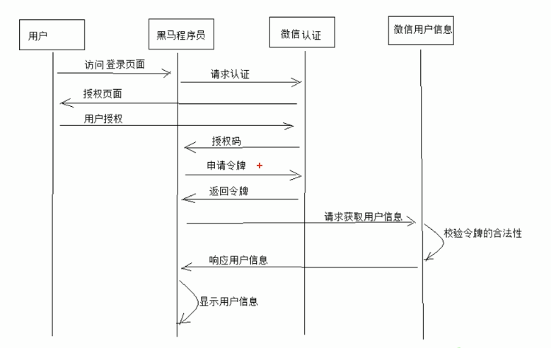

# Spring Security Oauth2.0

## 1. 分布式系统认证方案

### 1.1 分布式系统架构


### 1.2 分布式认证需求

分布式系统的每个服务都会有认证，授权的需求，如果每个服务都实现一套认证授权逻辑会非常冗余，考虑到分布式系统共享性的特点，需要由独立的认证服务处理系统认证授权的请求；考虑分布式系统开放性的特点，不仅对系统内部服务提供认证，对第三方系统也要提供认证。分布式认证的需求总结如下：

#### 统一认证授权

提供独立的认证服务，统一处理认证授权。

无论是不同类型的用户，还是不同种类的客户端(web端，H5，APP)，均采用一致的认证，权限，会话机制，实现统一认证授权。

要实现统一认证方式必须可扩展，支持各种认证需求，比如：用户名密码认证，短信验证码，二维码，人脸识别等认证方式，并可以非常灵活的切换。

#### 应用接入认证

应提供扩展和开放能力，提供安全的系统对接机制，并可开放部分API给接入第三方使用，一方应用(内部系统)和三方应用(第三方应用)均采用统一接入机制。


### 1.3 分布式认证方案

#### 1.3.1 基于session的认证方式

在分布式的环境下，基于session的认证会出现一个问题，每个应用服务器都要在session中存储用户身份信息，通过负载均衡将本地的请求 分配到另一个应用服务需要将session信息带过去，否则会重新认证。


session复制：多台应用服务器之间同步session,使session保持一致，对外透明。

session黏贴：当用户访问集群中某台服务器后，强制指定后续所有请求均落到此机器上。

session集中存储：将session存入分布式缓存中，所有服务器应用实例统一从分布式缓存中存取Session.

总台来讲，基于session的认证方式，可以更好的在服务端对会话进行控制，且安全性较高。但是，session机制方式基于cookie,在复杂多样的移动客户端上不能有效的使用，并且无法跨域，另外随着系统的扩展需提高session的复制，黏贴及存储的容错性。

#### 1.3.2 基于token的认证方式

基于token的认证方式，服务端不用存储认证数据，易维护扩展性强，客户端可以把token存在任意地方，并且可以实现web和app统一认证机制。其缺点也很明显，token由于包含信息，因此一版数据量较大，而且每次请求都需要传递，因此比较占带宽。另外，token的签名验签操作也会给cpu带来额外的处理负担。


#### 技术方案

根据以上分析，决定采用token的认证方式，它的优点是：

- 适合统一认证的机制，客户端，一方应用，三方应用都遵循一致的认证机制。
- token认证方式对第三方应用接入更合适，因为它更开放，可使用当前流行的开放协议Oauth2.0,JWT等。
- 一般情况服务端无需存储会话信息，减轻了服务端的压力。

分布式系统认证技术方案如下图:


## 2. OAuth2.0

### 2.1 OAuth2.0介绍

OAuth2.0(开放授权)是一个开放标准，允许用户授权第三方应用访问他们存储在另外的服务提供者上的信息，而不需要将用户和密码提供给第三方应用或分享他们数据的所有内容。

https://tools.ietf.org/html/rfc6749

OAuth2.0认证的一个例子:



OAuth2.0协议流程:


OAuth2.0包括以下角色：

- 客户端：

  本身不存储资源，需要通过资源拥有者的授权去请求资源服务器的资源，比如：Android客户端，Web客户端，浏览器端，微信客户端等。

- 资源拥有者：

  通常为用户，也可以是应用程序，即该资源的拥有者。

- 授权服务器(也称认证服务器)

  用于服务提供商对资源拥有者的身份进行认证，对访问资源进行授权，认证成功后会给客户端发放令牌(access_token),作为客户端访问资源服务器的凭证。本例为微信的认证服务器。

- 资源服务器

  存储资源的服务器，本例子为微信存储的用户信息。

现在还有一个问题，服务提供商能允许随便一个客户端就接入到它的授权服务器吗？答案是否定的，服务提供商会给准入的接入方一个身份，用于接入时的凭据：

client_id:客户端标识

client_secret:客户端秘钥

因此，准确来说，授权服务器对两种OAuth2.0中的两个角色进行认证授权：分别是资源拥有者，客户端。

### 2.2 Spring Cloud Security OAuth2

#### 2.2.1环境介绍：

Spring-Security-OAuth2是对OAuth2的一种实现，并且跟我们之前学习的Spring Security相辅相成，与Spring Cloud体系的集成也非常便利。

OAuth2.0的服务提供方涵盖两个服务，即授权服务(Authorization Server, 也叫认证服务)和资源服务(Resource Server),使用Spring Security OAuth2的时候你可以选择把他们在同一个应用程序中实现，也可以选择建立使用同一个授权服务的多个资源服务。

授权服务(Authorization Server) 应包含对接入端以及登入用户的合法性进行验证并颁发token等功能，对令牌的请求端点由Spring MVC控制器进行实现，下面是配置一个认证服务必须要实现的endpoints:

**AuthorizationEndpoint:** 服务于认证请求。默认URL：/oauth/authorize.

**TokenEndpoint**服务于访问令牌的请求。默认URL： /oauth/token。

资源服务(Resource Server),应包含对资源的保护功能，对非法请求进行拦截，对请求中token进行鉴权等，下面的过滤器用于实现OAuth2.0资源服务：

**OAuth2AuthenticaitonProcessingFilter**用来对请求给出的身份令牌鉴权解析。


认证流程如下：

1. 客户端请求UAA授权服务进行认证。
2. 认证通过后由UAA颁发令牌。
3. 客户端携带令牌Token请求资源服务。
4. 资源服务校验令牌的合法性，合法即返回资源信息。

#### 2.2.2 环境搭建


### 2.3 授权服务配置

#### 2.3.1 EnableAuthorizationServier

可以用@EnableAuthorizationServer注解并继承AuthorizationServerConfigurerAdapter来配置OAuth2.0授权服务器。

在config包下创建AuthorizaitonServer:

```java
public class AuthorizationServerConfig extends AuthorizationServerConfigurerAdapter
{
    ...
}
```

AuthorizationServerConfigurerAdapter要求配置以下几个类，这几个类是由Spring创建的独立的配置对象，它们会被Spring传入AuthorizationServerConfigurer中进行配置。

```java
public class AuthorizationServerConfigurerAdapter implements AuthorizationServerConfigurer {
    public AuthorizationServerConfigurerAdapter() {
    }

    public void configure(AuthorizationServerSecurityConfigurer security) throws Exception {
    }

    public void configure(ClientDetailsServiceConfigurer clients) throws Exception {
    }

    public void configure(AuthorizationServerEndpointsConfigurer endpoints) throws Exception {
    }
}
```

**ClientDetailsServiceConfigurer**:

用来配置客户端详情服务(ClientDetailService),客户端详情信息在这里进行初始化，你能够把客户端详情信息写死在这里或者是通过数据库来存储调取详情信息。可以理解为：哪些客户端可以访问授权认证服务和他们的一些基础配置。

**AuthorizationServerEndpointsConfigurer endpoints**:

用来配置令牌(token)的访问端点和令牌服务(token services)，即提供token访问和token一些服务的URL。

**AuthorizationServerSecurityConfigurer**:

用来配置令牌端点的安全约束,即暴漏上边这些令牌访问URL的访问策略。

##### 2.3.1.1 客户端详情

```java
// 配置客户端详情信息,用来指定哪些客户端可以访问授权认证服务。
// 客户端信息可以配置到内存中，也可以存到数据库中。
public void configure(ClientDetailsServiceConfigurer clients) throws Exception {
    clients.inMemory() // 使用in-memory方式存储
        .withClient("c1") // 客户端id
        .secret(new BCryptPasswordEncoder().encode("123")) // 客户端秘钥
        .resourceIds("res1") // 资源列表
        .authorizedGrantTypes("authorization_code", "password", "client_credentials",
                              "implicit", "refresh_token") // oauth2.0支持的认证类型
        .scopes("all") // 授权的范围 只读等
        .autoApprove(false) // 授权码模式时跳转到授权页面,true直接发令牌,不跳转
        .redirectUris("http://www.baidu.com");
}
```

##### 2.3.1.2令牌访问端点

```java
@Autowired
private TokenStore tokenStore;
@Autowired
private ClientDetailsService clientDetailsService;
@Autowired
private AuthorizationCodeServices authorizationCodeServices;
@Autowired
private AuthenticationManager authenticationManager;
// 令牌访问端点
public void configure(AuthorizationServerEndpointsConfigurer endpoints) throws Exception {
    // 密码模式需要
    endpoints.authenticationManager(authenticationManager)
        // 授权码模式需要
        .authorizationCodeServices(authorizationCodeServices)
        // 令牌管理服务
        .tokenServices(tokenServices())
        // 允许post提交
        .allowedTokenEndpointRequestMethods(HttpMethod.POST);
}

// 令牌管理模式
@Bean
public AuthorizationServerTokenServices tokenServices() {
    DefaultTokenServices defaultTokenServices = new DefaultTokenServices();
    // 客户端信息服务
    defaultTokenServices.setClientDetailsService(clientDetailsService);
    // 是否产生刷新令牌
    defaultTokenServices.setSupportRefreshToken(true);
    // 令牌存储侧率
    defaultTokenServices.setTokenStore(tokenStore);

    //        TokenEnhancerChain tokenEnhancerChain = new TokenEnhancerChain();
    //        tokenEnhancerChain.setTokenEnhancers(Arrays.asList(JwtAccessTokenConverter));
    //        defaultTokenServices.setTokenEnhancer(tokenEnhancerChain);

    defaultTokenServices.setAccessTokenValiditySeconds(7200);
    defaultTokenServices.setRefreshTokenValiditySeconds(259200);
    return defaultTokenServices;
}

```

TokenConfig

```java
package com.zhangxp.config;

import org.springframework.context.annotation.Bean;
import org.springframework.context.annotation.Configuration;
import org.springframework.security.oauth2.provider.token.TokenStore;
import org.springframework.security.oauth2.provider.token.store.InMemoryTokenStore;

@Configuration
public class TokenConfig {
    // 令牌的存储方式
    @Bean
    public TokenStore tokenStore() {
        // 内存方式,生成普通令牌
        return new InMemoryTokenStore();
    }
}
```

##### 2.3.1.3 访问约束

```java
// 令牌访问端点的安全策略
public void configure(AuthorizationServerSecurityConfigurer security) throws Exception {
    security.tokenKeyAccess("permitAll()")  // /oauth/token_key这个url是公开的,jwt令牌时公钥访问端点
        .checkTokenAccess("permitAll()") // /oauth/check_token  校验令牌的请求放行
        .allowFormAuthenticationForClients(); // 允许进行表单验证
}
```

 

### 2.4 授权码模式


#### 2.4.1 授权码模式流程:

1)客户端向认证服务提交身份信息和重定向的url,这个url可以理解为客户端的一个网页,将授权码返回到哪个url，从而客户端可以通过此url进行授权码的获取和下一步操作。

http://localhost:5000/auth-service/oauth/authorize?client_id=c1&response_type=code&scope=all&redirect_uri=http://www.baidu.com

2)授权服务器认证用户的身份信息，并向用户即资源用着者询问，是否授权？

3)用户同意授权，返回授权码，通过重定向的1中的url地址

4)客户端拿到授权码,向认证服务器申请令牌:

http://localhost:5000/auth-service/oauth/token?client_id=c1&client_secret=123&grant_type=authorization_code&code=JS9JzH&redirect_uri=http://www.baidu.com

这里的重定向url必须与授权码申请时的重定向url一致，为什么呢？因为授权服务器会将token返回到此url,如果与申请授权码时的url不一致，就无法保证是申请的url获取到token,安全性就无法保证了。即返回token给申请的客户端。

5)客户端通过重定向url所携带的token,获取token.

```
{
    "access_token": "8ad0b23a-fa1e-42cb-a97b-95dd756f7a7b",
    "token_type": "bearer",
    "refresh_token": "5621b76e-73f3-4253-a304-f28f597ebe6d",
    "expires_in": 7199,
    "scope": "all"
}
```


6)客户端通过token向资源服务器申请资源。

这就是授权码模式的流程。

#### 2.4.2 简化模式流程:


1) 资源拥有者打开客户端，客户端要求资源拥有者给予授权，它将浏览器被重定向到授权服务器，重定向时会附加客户端的身份信息，如：

```url
http://localhost:5000/auth-service/oauth/authorize?client_id=c1&response_tye=token&scope=all&redirect_uri=http://www.baidu.com
```

参数描述同授权码模式，注意response_type=token,说明是简化模式。

2)浏览器出现向授权服务器授权页面，之后将用户同意授权。

3)授权服务器将令牌(access_token)以Hash的形式存放在重定向uri的fargment中发送给浏览器。

https://www.baidu.com/#access_token=8ad0b23a-fa1e-42cb-a97b-95dd756f7a7b&token_type=bearer&expires_in=3137

注：fragment主要是用来表示URI所标识资源里的某个资源，在URI的末尾通过(#)作为fragment的开头，其中#不属于fragment的值。如https://domain/index#L18这个URI中L18就是fragment的值。大家只需要知道js通过相应浏览器地址栏变化的方式能获取fragment就行了。

一般来说，简化模式用于没有服务器端的第三方单页面应用，因为没有服务器端就无法接收授权码。

#### 2.4.3 密码模式流程:


1)资源拥有者将用户名，密码发送给客户端

2)客户端拿着资源拥有者的用户名，密码向授权服务器请求令牌(access_token),请求如下:

```url
http://localhost:5000/auth-service/oauth/token?client_id=c1&client_secret=123&grant_type=password&username=zhangxp&password=1111
```

3)授权服务器返回token:

{

  "access_token": "8ad0b23a-fa1e-42cb-a97b-95dd756f7a7b",

  "token_type": "bearer",

  "refresh_token": "5621b76e-73f3-4253-a304-f28f597ebe6d",

  "expires_in": 2585,

  "scope": "all"

}

#### 2.4.4 客户端模式:


1)客户端向授权服务器发送自己的身份信息，并请求令牌(access_token)

2)确认客户端身份无误后，将令牌(access_token)发送给client,请求如下:

```url
http://localhost:5000/auth-service/oauth/token?client_id=c1&client_secret=123&grant_type=client_credentials
```

这种模式是最方便但最不安全的模式，因此这就要求我们对client完全的信任。而client本身也是安全的。因此，这种模式一般用来提供给我们完全信任的服务器端服务。比如，合作方系统对接，拉取一组用户信息。

{

  "access_token": "a0eefc87-4c81-42e0-9974-8f77a268c7ec",

  "token_type": "bearer",

  "expires_in": 7199,

  "scope": "all"

}


### 2.5 JWT介绍

通过上边的测试我们发现，当资源服务和授权服务不在一起时资源服务使用RemoteTokenServices远程请求授权服务验证token,如果访问量较大将会影响系统的性能。

解决上边问题：

令牌采用JWT格式即可解决上边的问题，用户认证通过会得到一个JWT令牌，JWT令牌中已经包括了用户相关的信息，客户端只需要携带JWT访问资源服务，资源服务根据事先约定的算法自行完成令牌校验，无需每次都请求认证服务完成授权。

1.什么是JWT？

JSON Web Token(JWT)是一个开放的行业标准(RFC 7519),它定义了一种简洁的，自包含的协议格式，用于在通信双方传递json对象，传递的信息经过数字签名可以被验证和信任。JWT可以使用HMAC算法或使用RSA的公钥/私钥来签名，防止被篡改。

官网：https://jwt.io/

标准: https://tools.ietf.org/html/rfc7519

JWT令牌的优点：

1) jwt基于json,非常方便解析。

2)可以在令牌中自定义丰富的内容，易扩展。

3)通过非对称加密算法及数字签名技术，JWT防止篡改，安全性高。

4)资源服务使用JWT可不依赖认证服务即可完成授权。

缺点：

1）JWT令牌较长，占存储空间比较大。

#### 2.5.1 JWT结构

JWT令牌由三部分组成，每部分中间使用点(.)分隔，比如xxxxx.yyyyy.zzzzz

**Header**

头部包括令牌的类型(即JWT)及使用的哈希算法(如HMAC SHA256 或RSA)

一个例子如下：

下边是Header部分的内容

```
{
	"alg": "HS256",
	"typ": "JWT"
}
```

将上边的内容使用Base64Url编码，得到一个字符串就是JWT令牌的第一部分。

**Payload**

第二部分是负载，内容也是一个json对象，它是存放有效信息的地方，它可以存放jwt提供的现成字段，比如： iss(签发者),exp(过期时间戳),sub(面向的用户)等，也可自定义字段。

此部分不建议存放敏感信息，因为此部分可以解码还原原始内容。

最后将第二部分负载使用Base64Url编码，得到一个字符串就是JWT令牌的第二部分。

```
{
	"sub": "1234567890",
	"name": "456",
	"admin": true
}
```

**Signature**

第三部分是签名，此部分用于防止jwt内容被篡改。

这个部分使用base64url将前两部分进行编码，编码后使用点(.)连接组成字符串，最后使用header中声明签名算法进行签名。

一个例子：

```
HMACSHA256(
	base64UrlEncode(header) + "." +
	base64UrlEncode(payload),
	secret
)
```

base64UrlEncode(header): jwt令牌的第一部分。

base64UrlEncode(payload): jwt令牌的第二部分。

secret: 签名所使用的密钥。

### 2.6 完善环境配置

截止目前客户端信息和授权码仍然存储在内存中，生产环境中通常会存储在数据库中，下边完善环境的配置:

#### 2.6.1创建表

Spring OAuth2已经设计好了数据库的表,且不可变。

```sql
DROP TABLE IF EXISTS 'oauth_client_details';
CREATE TABLE 'oauth_client_details'
('client_id' varchar(256) NOT NULL,
'resource_ids' varchar(256) DEFAULT NULL,
)
```

## 3. Spring Security实现分布式系统授权

#### 3.1 需求分析


1. UAA认证服务负责认证授权。
2. 所有请求经过网关到达微服务。
3. 网关负责鉴权客户端以及请求转发。
4. 网关将token解析后传给微服务，微服务进行授权。

#### 3.2 注册中心

#### 3.3 网关

网关整合OAuth2.0有两种思路，一种是认证服务器生成jwt令牌,所有请求统一在网关层验证，判断权限等操作；另一种是由个资源服务处理，网关只做请求转发。

我们选用第一种。我们把API网关作为OAuth2.0的资源服务器角色，实现接入客户端权限拦截，令牌解析并转发当前登录用户信息(jsonToken)给微服务，这样下游微服务就不需要关心令牌格式解析以及OAuth2.0相关机制了。

API网关在认证授权体系中主要负责两件事：

1）作为OAuth2.0的资源服务器角色，实现接入方权限拦截。

2）令牌解析并转发当前登录用户信息(明文token)给微服务

微服务拿到明文token(明文token中包含登录用户的身份信息和权限信息)后也需要做两件事:

1) 用户授权拦截(看当前用户是否有权访问该资源)

2)将用户信息存储进当前线程上下文(有利于后续业务逻辑损失获取当前用户信息)

