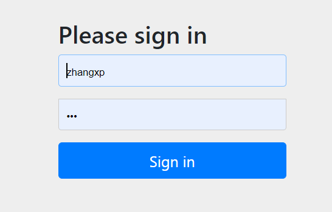
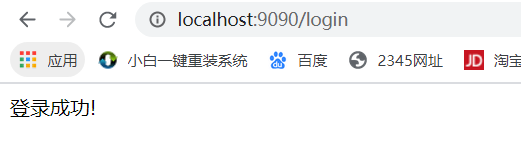
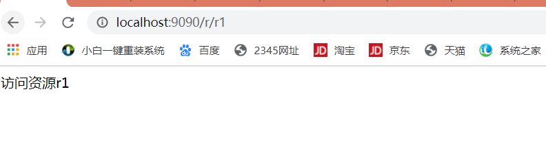
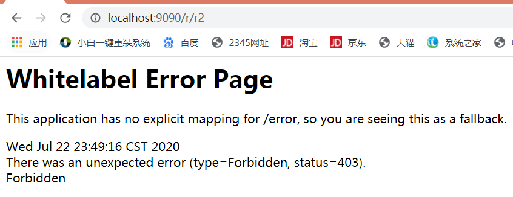
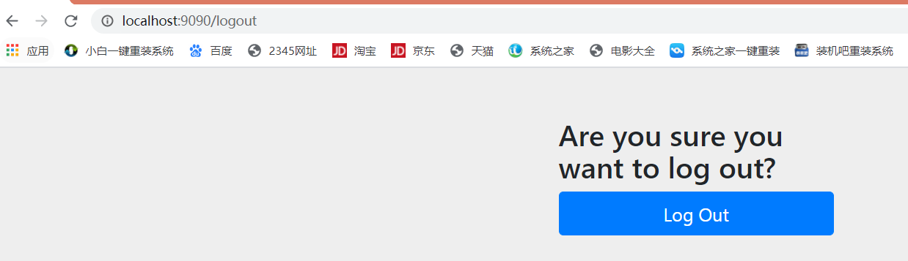
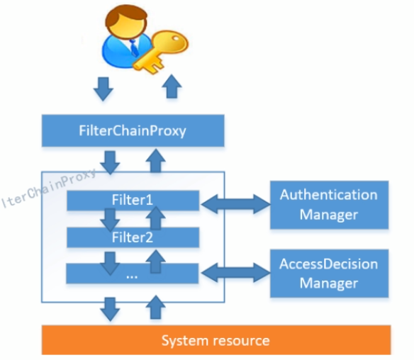
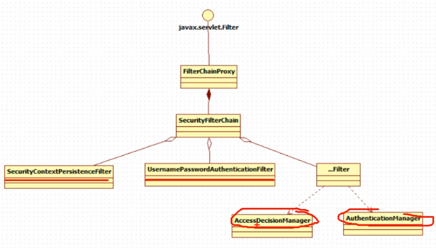
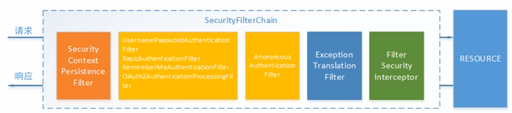
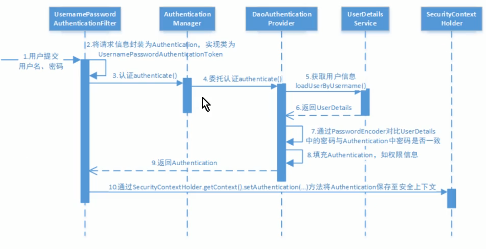

# Spring Security

## 1. 快速上手

### 1.1 pom.xml

```xml
<?xml version="1.0" encoding="UTF-8"?>
<project xmlns="http://maven.apache.org/POM/4.0.0"
         xmlns:xsi="http://www.w3.org/2001/XMLSchema-instance"
         xsi:schemaLocation="http://maven.apache.org/POM/4.0.0 http://maven.apache.org/xsd/maven-4.0.0.xsd">
    <modelVersion>4.0.0</modelVersion>

    <groupId>com.zhangxp</groupId>
    <artifactId>spring-security-learn</artifactId>
    <version>1.0-SNAPSHOT</version>

    <properties>
        <java.version>1.8</java.version>
        <springboot.version>2.2.6.RELEASE</springboot.version>
        <mysql.version>8.0.11</mysql.version>
    </properties>

    <!-- 1. springboot -->
    <parent>
        <groupId>org.springframework.boot</groupId>
        <artifactId>spring-boot-starter-parent</artifactId>
        <version>2.2.6.RELEASE</version>
    </parent>

    <dependencies>
        <!--2. spring boot web 组件整合了springmvc和spring-->
        <dependency>
            <groupId>org.springframework.boot</groupId>
            <artifactId>spring-boot-starter-web</artifactId>
        </dependency>

        <dependency>
            <groupId>org.springframework.boot</groupId>
            <artifactId>spring-boot-starter-test</artifactId>
            <scope>test</scope>
        </dependency>

        <!-- 3. 使用mybatis插件自动生成的代码 -->
        <dependency>
            <groupId>tk.mybatis</groupId>
            <artifactId>mapper-spring-boot-starter</artifactId>
            <version>2.0.4</version>
        </dependency>
        

        <dependency>
            <groupId>mysql</groupId>
            <artifactId>mysql-connector-java</artifactId>
            <version>${mysql.version}</version>
        </dependency>


        <!--4. springsecurity 安全控制-->
        <dependency>
            <groupId>org.springframework.boot</groupId>
            <artifactId>spring-boot-starter-security</artifactId>
        </dependency>

    </dependencies>
</project>
```

### 1.2 application.yml

```yaml
spring:
  http:
    encoding:
      force: true
      charset: UTF-8
  datasource:
    driver-class-name: com.mysql.cj.jdbc.Driver
    url: jdbc:mysql://49.232.105.82:3308/myblog?useSSL=false
    username: root
    password: 7324368Best!@
server:
  port: 9090
mybatis:
  mapper-locations: classpath*:com/zhangxp/blog/mapper/xml/*.xml
```

### 1.3 安全配置

spring security提供了用户名密码登录，退出，会话管理等认证功能，只需要配置即可使用。

1)在config包下定义WebSecurityConfig继承自WebSecurityConfigureAdapter, 安全配置的内容包括：用户信息，密码编码器，安全拦截机制。

```java
package com.zhangxp.config;


import org.springframework.cglib.proxy.NoOp;
import org.springframework.context.annotation.Bean;
import org.springframework.context.annotation.Configuration;
import org.springframework.security.config.annotation.web.builders.HttpSecurity;
import org.springframework.security.config.annotation.web.configuration.EnableWebSecurity;
import org.springframework.security.config.annotation.web.configuration.WebSecurityConfigurerAdapter;
import org.springframework.security.core.userdetails.User;
import org.springframework.security.core.userdetails.UserDetailsService;
import org.springframework.security.crypto.password.NoOpPasswordEncoder;
import org.springframework.security.crypto.password.PasswordEncoder;
import org.springframework.security.provisioning.InMemoryUserDetailsManager;

@Configuration
public class WebSecurityConfig extends WebSecurityConfigurerAdapter {
    /**
     * 配置用户信息,包括用户姓名，密码，权限等信息
     * @return UserDetailsService
     */
    @Bean
    public UserDetailsService userDetailsService()
    {
        // 基于内存的方式
        InMemoryUserDetailsManager manager = new InMemoryUserDetailsManager();
        manager.createUser(User.withUsername("zhangxp").password("123").authorities("p1").build());
        manager.createUser(User.withUsername("zhangxa").password("123").authorities("p2").build());
        return manager;
    }

    /**
     * 密码编码器，采用何种方式校验密码
     * @return
     */
    @Bean
    public PasswordEncoder passwordEncoder()
    {
        return NoOpPasswordEncoder.getInstance();
    }

    /**
     *  安全拦截机制
     * @param httpSecurity
     * @throws Exception
     */
    @Override
    protected void configure(HttpSecurity httpSecurity) throws Exception
    {
        httpSecurity.authorizeRequests()
                .antMatchers("/r/r1").hasAnyAuthority("p1")
                .antMatchers("/r/r2").hasAnyAuthority("p2")
                .antMatchers("/hi/**").authenticated() // /hi/**请求必须认证通过
                .anyRequest().permitAll()// 其他所有请求放行
                .and()
                .formLogin()// 允许表单登录
                .successForwardUrl("/login-success"); // 登录成功后跳转的地址

    }
}
```

### 1.4 测试资源

```java
package com.zhangxp.controller;

import org.springframework.web.bind.annotation.RequestMapping;
import org.springframework.web.bind.annotation.RestController;

@RestController
public class HiController {
    @RequestMapping("/hi")
    public String Hello()
    {
        return "Hello Spring Security!";
    }

    /**
     * 测试资源r1
     * @return
     */
    @RequestMapping("/r/r1")
    public String r1()
    {
        return "访问资源r1";
    }

    /**
     * 测试资源r2
     * @return
     */
    @RequestMapping("/r/r2")
    public String r2()
    {
        return "访问资源r2";
    }

    /**
     * 登录成功跳转页面
     * @return
     */
    @RequestMapping("/login-success")
    public String success()
    {
        return "登录成功!";
    }

    @RequestMapping("/logout")
    public String logout()
    {
        return "退出登录!";
    }
}

```

### 1.5 webconfig

```java
package com.zhangxp.config;

import org.springframework.context.annotation.Configuration;
import org.springframework.web.servlet.config.annotation.ViewControllerRegistry;
import org.springframework.web.servlet.config.annotation.WebMvcConfigurer;

@Configuration
public class WebConfig implements WebMvcConfigurer {

    /**
     * 默认根路径跳转到/login,此url是spring security提供
     * @param registry
     */
    @Override
    public void addViewControllers(ViewControllerRegistry registry) {
        registry.addViewController("/").setViewName("redirect:/login");
    }
}

```

### 1.6 启动服务

自动跳转到登录面



输入用户名，密码，跳转到登录成功页面：



访问/r/r1:



访问/r/r2:



退出登录



## 2. 工作原理

### 2.1 结构总览

Spring Security所解决的问题就是**安全访问控制**，而安全访问控制功能其实就是对所有进入系统的请求进行拦截，校验每个请求是否能够访问它所期望的资源。根据前边知识的学习，可以通过Filter或AOP等技术来实现，Spring Security对Web资源的保护是靠**Filter**实现的,所以从这个Filter来入手，逐步深入Spring Security原理。

当初始化Spring Security时,会创建一个名为SpringSecurityFilterChain的Servlet过滤器，类型为org.springframework.security.web.FilterChainProxy,它实现了javax.servlet.Filter,因此外部的请求会经过此类，下图是Spring Security过滤器链结构图:



FilterChainProxy是一个代理，真正起作用的是FilterChainProxy中SecurityFilterChain所包含的各个Filter,同时这些Filter作为Bean被Spring管理，它们是Spring Security的核心，各有各的职责，但是他们并不直接处理用户的认证，也不直接处理用户的授权，而是把他们交个了认证管理器(AuthenticationManager)和决策管理器(AccessDecisionManager)进行处理，下图是FilterChainProxy相关类的UML图示:



spring Security功能的实现主要是由一些列过滤器链相互配合完成。



下面介绍过滤器链中主要的几个过滤器及其作用：

**SecurityContextPersistenceFilter**:这个Filter是整个拦截过程的入口和出口(也就是第一个和最后一个拦截器)，会在请求开始时从配置好的SecurityContextRepository中获取SecurityContext,然后把它设置给SecurityContextHolder.在请求完成后将SecurityContextHolder所持有的SecurityContext再保存到配置好的SecurityContextRepository,同时清除securityContextHolder所持有的SecurityContext;

**UsernamePasswordAuthenticationFilter**:用于处理来自表单提交的认证。该表单必须提供对应的用户名和密码，其内部还有登录成功或失败后进行处理的AuthenticationSuccessHandler和AuthenticationFailureHandler,这些都可以根据需求做相应改变；

**FilterSecurityInterceptor:**是用于保护web资源的,使用AccessDecisionManager对当前用户进行授权访问。

ExceptionTranslationFilter:能够捕获来自FilterChain所有的异常，并进行处理。但是它只会处理两类异常：AuthenticationException和AccessDeniedException,其它的异常它会继续抛出。

### 2.2 认证流程

#### 2.2.1 认证流程



让我们仔细分析认证过程：

1.用户提交用户名，密码被SecurityFilterChain中的UsernamePasswordAuthenticationFilter过滤器获取到，封装为请求Authentication,通常情况下是UsernamePasswordAuthenticationToken这个实现类。

2.然后过滤器将Authentication提交至认证管理器(AuthenticationManager)进行认证

3.认证成功后，AuthenticationManager身份管理器返回一个被填充满了信息的(包括上面提取到的权限，身份信息，细节信息，但密码通常会被移除)Authentication实例。

4.SecurityContextHolder安全上下文容器将第3步填充了信息的Authentication,通过SecurityContextHolder.getContext().setAuthenticaiton()方法，设置到其中。

#### 3.2.2.2  AuthenticationProvider

通过前面的Spring Security认证流程我们得知，认证管理器(AuthenticationManager)委托AuthenticationProvider完成认证工作。

AuthenticationProvider是一个接口，定义如下:

```java
public interface AuthenticationProvider {
    Authentication authenticate(Authentication var1) throws AuthenticationException;

    boolean supports(Class<?> var1);
}
```

authenticate()方法定义了认证的实现过程，它的参数是一个Authentication,里面包含了登录用户的定义的用户，密码等。而返回值也是一个Authentication,这个Authentication则是在认证成功后，将用户的权限及其他信息重新组装后生成。

Spring Security中维护着一个List<AuthenticationProvider>列表，存放多种认证方式，不同的认证方式使用不同的AuthenticationProvider.如使用用户密码登录时，使用provider1,短信登录时使用provider2等等

每个AuthenticationProvider需要实现supports()方法来表名自己支持的认证方式，如我们使用表单方式认证时，在提交请求时Spring Security会生成UsernamePasswordAuthenticationToken,它是一个Authentication,里面封装着用户提交的用户名，密码信息。而对应的，是哪个AuthenticationProvider来处理它?

我们在DaoAuthenticationProvider的基类AbstractUserDetailsAuthenticationProvider发现以下代码：

```java
    public boolean supports(Class<?> authentication) {
        return UsernamePasswordAuthenticationToken.class.isAssignableFrom(authentication);
    }
```

也就是说当web表单提交用户密码时，Spring Security由DaoAuthenticationProvider处理。

最后，我们来看一下Authentication的结构，它是一个接口，我们之前提到的UsernamePasswordAuthenticationToken就是它的实现之一:

```java
public interface Authentication extends Principal, Serializable {
    Collection<? extends GrantedAuthority> getAuthorities();

    Object getCredentials();

    Object getDetails();

    Object getPrincipal();

    boolean isAuthenticated();

    void setAuthenticated(boolean var1) throws IllegalArgumentException;
}

```

#### 3.2.2.3 UserDetailsService

1) 认识UserDetailsService

现在咱们知道DaoAuthenticationProvider处理了web表单的认证逻辑，认证成功后既得到一个Authentication(UsernamePasswordAuthentication Token实现)，里面包含了身份信息(Principal)。这个身份信息就是一个Object,大多数情况下它可以被强转为UserDetails对象。

DaoAuthenticationProvider中包含了一个UserDetailService实例，它负责根据用户名提取用户信息UserDetails(包含密码),而后DaoAuthenticationProvider会去比对UserDetailsService提取的用户密码与用户提交的密码是否匹配作为认证成功的关键依据,因此可以通过将自定义的UserDetailsService公开为spring bean来自定义身份验证

```java
public interface UserDetailsService {
    UserDetails loadUserByUsername(String var1) throws UsernameNotFoundException;
}
```

很多人把DaoAuthenticationProvider和UserDetailService的职责混淆，其实UserDetailsService只负责从特定的地方(通常是数据库)加载用户信息，仅此而已。而DaoAuthenticationProvider的职责更大，它完成完整的认证流程，同时会把UserDetails填充至Authentication。

UserDetails用户信息的真面目:

```java
public interface UserDetails extends Serializable {
    Collection<? extends GrantedAuthority> getAuthorities();

    String getPassword();

    String getUsername();

    boolean isAccountNonExpired();

    boolean isAccountNonLocked();

    boolean isCredentialsNonExpired();

    boolean isEnabled();
}

```

### 3. 会话

用户认证通过后，为了避免用户的每次操作都进行认证可将用户的信息保存在会话中。spring security提供会话管理，认证通过后将身份信息放入SecurityContextHolder上下文,SecurityContext与当前线程进行绑定，方便获取用户身份。

#### 3.1 获取用户身份

在controller里增加获取用户身份的方法,如下:

```java
private String getUserName() {
    String username = null;
    Authentication authentication =  SecurityContextHolder.getContext().getAuthentication();
    // 用户身份
    Object principal = authentication.getPrincipal();
    if (principal == null)
    {
        username = "匿名";
    }else if (principal instanceof UserDetails)
    {
        UserDetails userDetails = (UserDetails) principal;
        username = userDetails.getUsername();
    }else
    {
        username = principal.toString();
    }
    return username;
}
```

#### 3 .2会话控制

我们可以通过以下选项准确控制会话何时创建以及Spring Security如何与之交互:

配置方式:

```java
@Override
protected void configure(HttpSecurity http) throws Excption{
    http.sessionManagement()
        .sessionCreationPolicy(SessionCreationPolicy.IF_REQUIRED);  // 配置会话管理方式
}
```

默认情况下,Spring Security会为每个登录成功的用户新建一个Session,就是ifRequired.

若选用never,则指示Spring Security对登录成功的用户不创建session了，但若你的应用程序在某地方新建了session,那么Spring Security会用它的。

若使用stateless,则说明Spring Security对登录成功的用户不会创建Session了，你的应用程序也不会允许新建session.并且它会暗示不使用cookie,所以每个请求都需要重新进行身份验证。这种无状态架构适用于REST API及其无状态认证机制。

**会话超时**

可以在sevlet容器中设置Session的超时时间，如下设置Session有效期为3600s

spring boot 配置文件

```yaml
server.servlet.session.timeout=3600s
```

session超时之后，可以通过Spring Security设置跳转的路径

```java
http.sessionManagement()
    .expiredUrl("/login-view?error=EXPIRED_SESSION")
    .invalidSessionUrl("/login-view?error=INVALID_SESSION")
```

expired指session过期,invalidSession指传入的sessionId无效。